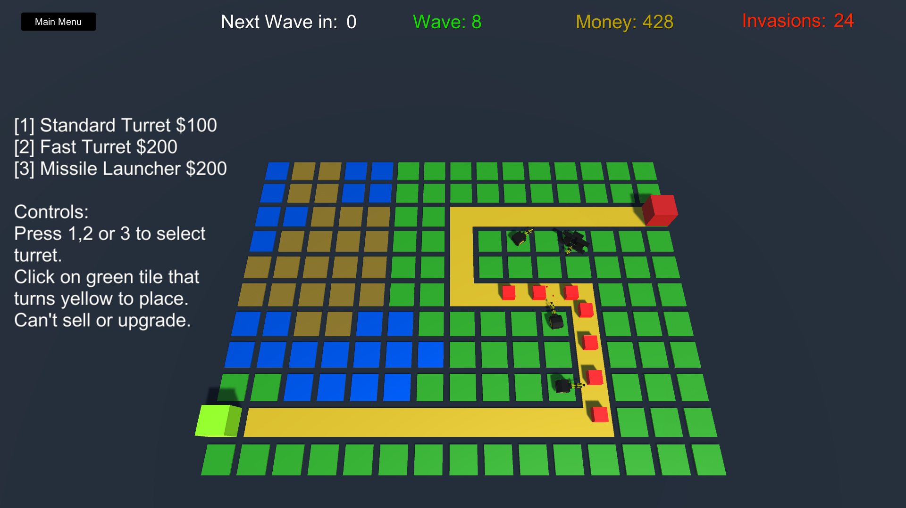

# Tower-Defense-Unity-Game

 This is public repository for my Unity game project submission for the hack4pan hackathon.
 
 Courtesy to: Brackeys, Unity, and Unity's Machine Learning. 

**Project Description:** This is a basic Tower Defense game made in Unity that I plan to implement with Unity's Machine Learning AI to come up with the best strategies to win a certain level.

**Project Goals:** My first priority is to make a barely playable mvp tower defense game. If I have time, I will try my best to implement Unity's Machine Learning and train the agents. If I get those done, I want to showcase the results of the AI strategies in-game or on the slides. I am also hoping this project can scale to the point twitch chat can vote on polls attached to the enemy and let the AI try to stop the polls enemy from going through. Those that goes through, can have the streamer act on those polls. 

Status: No machine learning AI or AI whatsoever. 

Link to demo: https://vorezii.itch.io/tower-defense

Link to slides https://docs.google.com/presentation/d/1ODXpXlMY52gqrzKe27qD_36o-HX3wEu37xUvLzEj6aw/edit?usp=sharing

Line to demo video: https://www.youtube.com/watch?v=OqkR_lz_GHc

=============================================

**About Me:** <b> </b>
Hi my name is Teevint and I am a UBC first year student. I started to get interested in software developemnt from game development.From then on, I created my first game, published to itch, got no downloads and started learning Java. I also took a peek into Web Developement with JavaScript, HTML5 and CSS. And now I am learning data science and more Java in university.  

**How did I come up with this project?**  <b> </b>
I have been taking programming and data science courses, while also learning game development on my own time. So when I came across the video on how an AI learn to play Monoply and then into an AI learning Bloons TD 6 I was hooked. I heard of hack4pan earlier, but I didn't had any ideas until then, so here we are. 

**Experience so far related to this project:**  <b> </b>
I have done a bit of 3D game developemnt with Unity creating my first game (basically a moddded copy of brackeys).
But haven't made a Tower Defense Game. 
I also learn C# in the middle of it and using that knowledge, I took Java Courses in High School and now in University as well. 
1 Week of beginner data science course, which means I basically have zero experience.
I also have zero experience in Machine Learning or AI, besides exposure in YouTube videos. 
